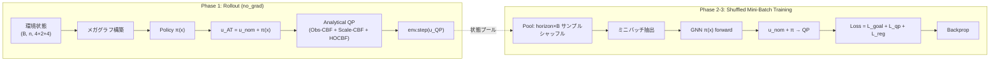

# Affine-Transform Swarm Control — Algorithm Specification

## 1. Overview

本システムは **GNN → Affine Transform → Analytical QP** のアーキテクチャにより、3機ドローンスワーム群のペイロード搬送における安全な分散制御を実現します。

**核心**: GNNがスワーム重心のアフィン変換パラメータ（並進加速度＋フォーメーション伸縮加速度）を出力し、解析的QPソルバーが障害物回避・スケール制限・ペイロード揺れ角制約をリアルタイムに満たしながら、動的フォーメーション変形によるナビゲーションを行います。



---

## 2. System Model

### 2.1 スワーム状態（4D Double Integrator + 2D Scale + 4D Payload）

各スワーム $i$ の状態は3つの成分からなります。

**重心状態** (CoM, 4D):
$$x_i = [p_x,\; p_y,\; v_x,\; v_y] \in \mathbb{R}^4$$

**スケール状態** (2D):
$$s_i = [s,\; \dot{s}] \in \mathbb{R}^2$$

$s$ はフォーメーションの拡大縮小率。$s=1.0$ が基準サイズ。

**ペイロード状態** (4D, サイドチャネル — GNNには入力しない):
$$\xi_i = [\gamma_x,\; \gamma_y,\; \dot{\gamma}_x,\; \dot{\gamma}_y] \in \mathbb{R}^4$$

### 2.2 制御入力（3D Affine Parameters）

$$u_i = [a_{cx},\; a_{cy},\; a_s] \in \mathbb{R}^3$$

| 成分 | 意味 |
|------|------|
| $a_{cx}, a_{cy}$ | スワーム重心の並進加速度 |
| $a_s$ | フォーメーションスケール加速度 |

### 2.3 離散時間力学

**並進ダイナミクス** (Double Integrator):
$$p_{t+1} = p_t + v_t \Delta t + \frac{1}{2} \frac{a_{\text{trans}}}{m} \Delta t^2$$
$$v_{t+1} = v_t + \frac{a_{\text{trans}}}{m} \Delta t$$

**スケールダイナミクス** (Double Integrator):
$$\dot{s}_{t+1} = \text{clamp}(\dot{s}_t + a_s \Delta t,\; -\dot{s}_\text{max},\; \dot{s}_\text{max})$$
$$s_{t+1} = \text{clamp}(s_t + \dot{s}_{t+1} \Delta t,\; s_\text{min},\; s_\text{max})$$

**ペイロード揺れダイナミクス** (非線形振り子 + ダンピング):
$$\ddot{\gamma}_x = -\frac{g}{l}\sin(\gamma_x) - \frac{a_{cx}}{l}\cos(\gamma_x) - c\dot{\gamma}_x$$
$$\ddot{\gamma}_y = -\frac{g}{l}\sin(\gamma_y) - \frac{a_{cy}}{l}\cos(\gamma_y) - c\dot{\gamma}_y$$

Semi-implicit Euler法で数値積分。

### 2.4 パラメータ一覧

| パラメータ | 記号 | 値 |
|---|---|---|
| タイムステップ | $\Delta t$ | 0.05 s |
| 質量 | $m$ | 0.1 kg |
| 最大制御入力 | $u_\text{max}$ | 0.3 N |
| 最大速度 | $v_\text{max}$ | 1.0 m/s |
| 環境サイズ | — | 15.0 × 15.0 m |
| 障害物数 | $n_\text{obs}$ | 6 |

---

## 3. Swarm Geometry and Dynamic Bounding Circle

### 3.1 フォーメーション構成

各スワームは3機のドローンで構成され、正三角形フォーメーション（外接円半径 $R_\text{form}$）で配置されます。

$$R_\text{form} = l \cdot \sin(30°) = 0.5 \text{ m}$$

### 3.2 動的バウンディングサークル

フォーメーションのスケール $s$ に応じて包含半径が変化します:

$$r_\text{swarm}(s) = R_\text{form} \cdot s + r_\text{margin}$$

| パラメータ | 記号 | 値 |
|---|---|---|
| 基準フォーメーション半径 | $R_\text{form}$ | 0.5 m |
| マージン | $r_\text{margin}$ | 0.2 m |
| スケール下限 | $s_\text{min}$ | 0.4 |
| スケール上限 | $s_\text{max}$ | 1.5 |
| スケール速度上限 | $\dot{s}_\text{max}$ | 1.0 |

$s=1.0$ のとき $r_\text{swarm} = 0.7$ m、$s_\text{min}$ で $0.4$ m、$s_\text{max}$ で $0.95$ m。

### 3.3 安全条件

- **スワーム間衝突**: CoM間距離 $d_{ij} < r_\text{swarm}(s_i) + r_\text{swarm}(s_j)$
- **障害物衝突**: 矩形障害物の半サイズ＋ $r_\text{swarm}(s)$ の膨張領域
- **通信半径**: $R_\text{comm} = 3.0$ m

---

## 4. Dynamic HOCBF — $\gamma_\text{max}(s)$

### 4.1 揺れ角制限の動的化

スケール $s$ に応じて揺れ角の許容上限が変化します:

$$\gamma_\text{max}(s) = \gamma_\text{min} + (\gamma_\text{max,full} - \gamma_\text{min}) \cdot \frac{s - s_\text{min}}{s_\text{max} - s_\text{min}}$$

| パラメータ | 値 | 意味 |
|---|---|---|
| $\gamma_\text{min}$ | 0.2 rad | $s = s_\text{min}$ での厳しい制限 |
| $\gamma_\text{max,full}$ | 0.75 rad | $s = s_\text{max}$ での緩い制限 |

**効果**: フォーメーション拡大 → 揺れ角制限が緩和 → より大きな加速が許可 → ゴール到達が速くなる。障害物付近で縮小 → 揺れ角制限が厳格化 → 安全だが慎重な動き。

### 4.2 HOCBF構築（X方向の例、動的 $\gamma_\text{max}(s)$ 使用）

**1次CBF**:
$$h_1(\gamma_x) = \gamma_\text{max}(s)^2 - \gamma_x^2$$

**2次CBF**:
$$h_2 = \dot{h}_1 + \alpha_1 h_1 = -2\gamma_x \dot{\gamma}_x + \alpha_1(\gamma_\text{max}(s)^2 - \gamma_x^2)$$

**制御依存係数**:
$$C_x = \frac{2\gamma_x \cos(\gamma_x)}{l}$$

**定数項**:
$$D_x = 2\dot{\gamma}_x^2 - 2\gamma_x\left(-\frac{g}{l}\sin(\gamma_x) - c\dot{\gamma}_x\right) + \alpha_1(-2\gamma_x\dot{\gamma}_x) - \alpha_2 h_2$$

- $\alpha_1 = 2.0$, $\alpha_2 = 2.0$

---

## 5. Graph Structure and GNN

### 5.1 ノード構成 (`node_dim = 3`)

| ノード種別 | 特徴量 (3D one-hot) | 数 |
|---|---|---|
| Agent (スワーム) | `[1, 0, 0]` | $n$ |
| Goal | `[0, 1, 0]` | $n$ |
| Obstacle | `[0, 0, 1]` | $n_\text{obs}$ |

### 5.2 エッジ特徴量 (`edge_dim = 4`)

通信範囲 $R_\text{comm}$ 内のノード対を接続:

| 次元 | 内容 |
|------|------|
| 0–1 | $\Delta p_x, \Delta p_y$ (相対位置) |
| 2–3 | $\Delta v_x, \Delta v_y$ (相対速度) |

### 5.3 ネットワーク

| ネットワーク | 出力 | 役割 |
|---|---|---|
| **PolicyNetwork** $\pi_\phi(x)$ | $[\Delta a_{cx},\; \Delta a_{cy},\; a_s] \in \mathbb{R}^3$ | アフィン変換オフセット |

メッセージパッシング型GNN（Attention付き集約）。**GCBFNetworkは使用しない**（学習ベースCBFは削除）。

### 5.4 名目制御器（LQR + バネ復元力）

**並進**: LQRによるゴール追従
$$u_\text{trans} = -K(x - x_\text{goal}), \quad K \in \mathbb{R}^{2 \times 4}$$

**スケール**: バネ復元力で $s_\text{max}$ に向かって拡大
$$a_{s,\text{nom}} = k_\text{spring} \cdot (s_\text{max} - s) - c_\text{damp} \cdot \dot{s}$$

| パラメータ | 値 | 意味 |
|---|---|---|
| $k_\text{spring}$ | 0.5 | 拡大方向のバネ定数 |
| $c_\text{damp}$ | 0.3 | スケール速度のダンピング |

**最終名目入力**: $u_\text{nom} = [u_\text{trans},\; a_{s,\text{nom}}] \in \mathbb{R}^3$

**最終入力**: $u_\text{AT} = u_\text{nom} + \pi_\phi(x)$

---

## 6. Analytical QP Solver

### 6.1 最適化問題

$$\min_{X, \delta} \quad \frac{1}{2}\|X - u_\text{AT}\|^2 + p \sum_k \delta_k^2$$

subject to:

1. **Obstacle CBF** (ハード制約):
$$A_\text{obs} \cdot X + (\dot{h}_\text{drift} + \alpha h_\text{obs}) \geq 0$$
$h_\text{obs} = \|P_c - P_\text{obs}\|^2 - (r_\text{swarm}(s) + R_\text{obs})^2$

2. **Scale-CBF Lower** (ハード制約):
$$a_s + \alpha_1 \dot{s} + \alpha_2 (s - s_\text{min}) \geq 0$$

3. **Scale-CBF Upper** (ハード制約):
$$-a_s - \alpha_1 \dot{s} + \alpha_2 (s_\text{max} - s) \geq 0$$

4. **HOCBF Payload** (ソフト制約, スラック $\delta$ 付き):
$$C_x \cdot a_{cx} \geq D_x - \delta_x, \quad C_y \cdot a_{cy} \geq D_y - \delta_y$$

5. **入力制約**: $|a_\text{trans}| \leq u_\text{max}$

### 6.2 解法

全てPyTorchテンソル演算による**解析的半空間射影**:
- Scale-CBF: 1D clamp
- Obstacle-CBF: 繰り返し半空間射影
- HOCBF: スラック付き射影 ($p = 100.0$)
- 入力制約: Box clamp

**優先順位**: Scale-CBF → Obstacle-CBF → HOCBF → 入力制約

---

## 7. Training Algorithm

### 7.1 全体フロー（Shuffled Mini-Batch方式）

```
各学習ステップ:
  Phase 1: データ収集 (no_grad)
    - vec_env.reset()
    - horizon ステップのロールアウト
    - 各ステップで GNN Policy + LQR + spring → QP → env.step()
    - (agent, scale, payload, goal, obstacle) 状態を記録

  Phase 2: プール構築 + シャッフル
    - 全snapshots → pool (horizon × batch_size サンプル)
    - 時系列を気にせず、独立なi.i.d.サンプルとして扱う
    - ランダムシャッフル

  Phase 3: ミニバッチ学習 (n_epochs × ceil(pool/mini_batch) 回)
    - ミニバッチ抽出 → グラフ構築 → GNN forward
    - u_nom(LQR + spring) + π → u_AT
    - QP solve (no_grad) → u_QP
    - 損失計算 + backprop
```

### 7.2 損失関数

$$L = c_\text{goal} \cdot L_\text{goal} + c_\text{qp} \cdot L_\text{qp} + c_\text{reg} \cdot L_\text{reg}$$

| 損失項 | 定義 | 係数 | 目的 |
|--------|------|------|------|
| $L_\text{goal}$ | $\mathbb{E}[\|p - p_\text{goal}\|]$ | 1.0 | ゴール到達インセンティブ |
| $L_\text{qp}$ | $\mathbb{E}[\|u_\text{AT} - u_\text{QP}\|^2]$ | 2.0 | QP介入ペナルティ（安全なアクションを学ぶ） |
| $L_\text{reg}$ | $\mathbb{E}[\|\pi(x)\|^2]$ | 0.01 | GNN出力の正則化 |

**Safe/Unsafeのラベリングは不使用**。

### 7.3 最適化設定

| パラメータ | 値 |
|---|---|
| Optimizer | Adam |
| 学習率 | $3 \times 10^{-4}$ |
| Batch size | 128 |
| Horizon | 128 ステップ |
| Mini-batch size | 128 |
| Epochs (per step) | 4 |
| Gradient clipping | max norm 2.0 |
| 学習ステップ数 | 2000〜3000 |

Total gradient updates per step: $(128 \times 128) / 128 \times 4 = 512$

---

## 8. Inference (Evaluation / Visualization)

推論時は学習済み $\pi_\phi$ を用いて、各ステップで:

1. グラフ構築
2. $u_\text{nom}$ (LQR + spring) + $\pi_\phi(x)$ → $u_\text{AT}$
3. Analytical QP で安全フィルタリング（Obs-CBF + Scale-CBF + HOCBF）
4. `env.step(u_QP)`

### 8.1 評価指標

| 指標 | 定義 |
|---|---|
| Success Rate | 全エージェントがゴール半径内に到達したエピソードの割合 |
| Safety Rate | 一度も衝突が起きなかったステップの割合 |
| $\gamma_\text{mean}$ | 合成揺れ角 $\sqrt{\gamma_x^2 + \gamma_y^2}$ の平均 |
| $\gamma_\text{max}$ | 同上の最大値 |
| $\gamma_\text{viol}$ | $\gamma > \gamma_\text{max}(s)$ の動的違反率 |
| Scale [min, max] | 観測されたスケール範囲 |
| Control Effort | $\|a_\text{trans}\|$ の合計 |
| Goal Time | 全員がゴール到達した最初のステップ |

### 8.2 比較手法

| 手法 | アクション生成 |
|---|---|
| **Affine Policy** (提案手法) | GNN Policy + Analytical QP (Obs-CBF + Scale-CBF + HOCBF) |
| **HOCBF + LQR** | LQR + Spring + Analytical QP |
| **LQR only** | LQR + Spring のみ（安全フィルタなし） |

---

## 9. File Structure

| ファイル | 役割 |
|---|---|
| `gcbf_plus/env/vectorized_swarm.py` | バッチ化環境（学習用, B×n×(4+2+4)） |
| `gcbf_plus/env/swarm_integrator.py` | 単一環境（推論/可視化用） |
| `gcbf_plus/nn/policy_net.py` | PolicyNetwork（GNN → 3Dアフィンオフセット） |
| `gcbf_plus/algo/affine_qp_solver.py` | 解析的QPソルバー（Obs-CBF + Scale-CBF + HOCBF） |
| `gcbf_plus/algo/loss.py` | 損失関数 compute_affine_loss() |
| `gcbf_plus/utils/swarm_graph.py` | グラフ構築ユーティリティ |
| `gcbf_plus/train_swarm.py` | 学習ループ（Shuffled Mini-Batch方式） |
| `visualize.py` | 軌跡アニメーション（動的フォーメーション表示） |
| `evaluate.py` | ベンチマーク評価（プラグイン方式） |
